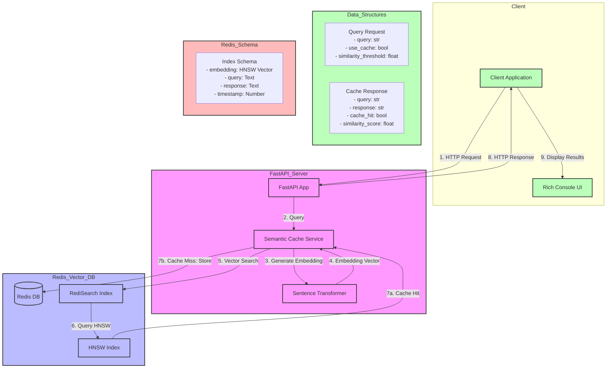

# Architecture Diagram

## Flow Description

1. **Client Request**: Client sends a query with optional caching parameters
2. **Query Processing**: FastAPI server receives request and forwards to Semantic Cache Service
3. **Embedding Generation**: Query is converted to vector embedding using Sentence Transformer
4. **Vector Search**: 
   - System searches Redis for similar queries using HNSW index
   - Similarity threshold determines cache hit/miss
5. **Cache Operations**:
   - Hit: Returns cached response with similarity score
   - Miss: Generates new response and stores in cache
6. **Response**: Returns results to client with cache status
7. **Display**: Client displays results in formatted table

## Key Components

- **FastAPI Server**: Main application server
- **Semantic Cache Service**: Manages caching logic and vector operations
- **Redis Vector DB**: 
  - Stores embeddings and responses
  - Uses HNSW index for efficient similarity search
  - Maintains cache size limits
- **Client**: 
  - Sends queries
  - Displays results with Rich console formatting
  - Shows cache statistics 